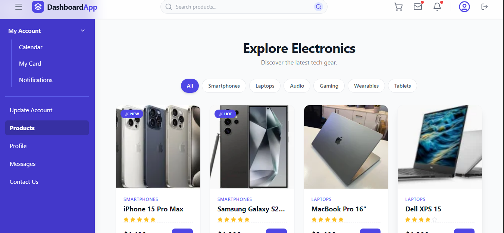

### Electronic Company Website

A modern web application for an electronic company built with React.

### 🚀 Features
Modern UI Design: Clean, responsive interface styled with Tailwind CSS.
Dynamic Product Catalog: Filter products by category and search in real-time.

### Functional Shopping Cart:
Add items to cart.
Slide-over cart drawer with total price calculation.
Remove items or clear cart.

### Authentication System:
Register: Create an account stored in LocalStorage.
Login: Validates credentials against registered users.
Protected Routes: Dashboard is inaccessible without login.
Logout: Clears session and redirects to login.

### Dashboard Sections:
Products: Interactive grid with add-to-cart functionality.
Profile: User details display.
Messages: Chat-style interface layout.
Calendar: Monthly view with event simulation.
Notifications: Interactive list with read/unread states.
Contact: Functional contact form.
Responsive Navigation:
Slide-in Sidebar.
Sticky Header with search and navigation controls.

### 🛠️ Technologies Used
Vite: Next-generation frontend tooling.
React 18: A JavaScript library for building user interfaces.
React Router DOM: For dynamic routing.
Tailwind CSS: A utility-first CSS framework.
Lucide React: Beautiful & consistent icons.
Heroicons: Additional icon set (optional).
React Hot Toast: Notifications.

### ⚙️ Installation
Clone the repository
git clone https://github.com/MCCREARY25/electronic-company.git

### Install dependencies
npm install

### Run the development server
npm run dev

### Open in browser
Navigate to http://localhost:5173 (or the port shown in your terminal).

### 📂 Project Structure
text

src/
├── components/        # Reusable UI components
│   ├── Header.jsx     # Top navigation bar
|   ├──ProtectedRoute.jsx # validates credentials
│   ├── Sidebar.jsx    # Side navigation menu
│   └── Footer.jsx     # Site footer
├── pages/             # Main route pages
│   ├── Dashboard.jsx  # Main layout container
│   ├── Login.jsx      # Login form
│   └── Register.jsx   # Registration form
├── sections/          # Dashboard content sections
│   ├── Products.jsx   # Product grid and logic
│   ├── Profile.jsx    # User profile view
│   ├── Messages.jsx   # Chat interface
│   ├── Calendar.jsx   # Calendar view
│   ├── Notifications.jsx
│   ├── MyCard.jsx     # Identity card
│   └── ...
├── App.jsx            # Main application logic & routing
├── main.jsx           # Entry point
└── index.css          # Global styles (Tailwind)
public/
├── assets/            # Static images
└── favicon.ico        # Application icon

### 💡 Usage Guide
Navigation
Click the Hamburger (Menu) icon in the header to toggle the sidebar.
Use the Sidebar links to switch between Dashboard sections.
Clicking the Logo navigates to the Dashboard home.

# Shopping
Use the Search Bar in the header to filter products by name or category.
Click Add on a product card to add it to the cart.
Click the Cart Icon to open the shopping cart drawer and see the total price.

## Authentication
Access /login or /register to see the authentication forms.

### 🎨 Customization
Changing Theme Colors
Modify the tailwind.config.js file to extend the default color palette, or search for indigo-600 in the code to replace the primary color.

 ### Adding Products
Edit the allProducts array inside src/sections/Products.jsx to add or modify items.

 # javascript
const allProducts = [
  { id: 13, name: "New Gadget", category: "Tech", price: 99, rating: 5, image: "gadget.jpg" },
  // ...
];

### License
Distributed under the MIT License. See LICENSE for more information.

